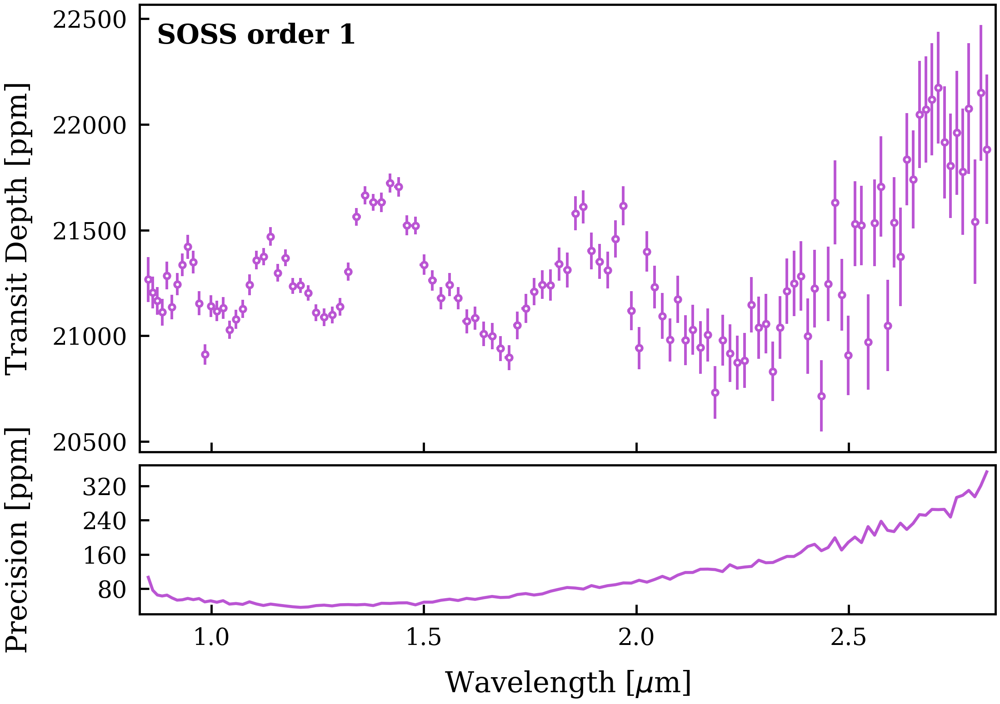

<p align="center">
  
</p>

<h1 align="center">Kool exOplAnet Lightcurve Analysis</h1>

**Transit light curves in, transmission spectra out.**

[](https://koala-jwst.readthedocs.io/en/latest/)

Koala fits extracted JWST time-series spectra with JAX and NumPyro. It
first learns the transit geometry and visit-wide systematics from the
white-light curve, then fits the wavelength channels in parallel and writes a
transmission spectrum with diagnostic plots and per-channel checks.

<p align="center">
  
</p>

The code supports NIRISS/SOSS, NIRSpec, and MIRI/LRS time series, several limb-darkening
and instrumental-trend models, GPU-parallel exact inference, resumable runs,
and predictive model stacking. Start with the supplied configurations rather
than building a model from scratch.

The JAXoplanet backend also supports eclipses, smooth phase curves, and
rotating stellar spots. See the [surface-model guide](docs/guides/phase_curves.md)
for configuration, physical assumptions, and repeatable synthetic examples.
The [executed surface tutorial](docs/tutorials/synthetic_surfaces.md) includes
eclipse and day/night spectra, a thermal map with uncertainty, stellar-spot
recovery, corner plots, and residual diagnostics, with PNG/PDF downloads.

## Get started

Download and extract the GitHub source ZIP, open a terminal in the extracted
`koala-main` folder, and install Koala:

```bash
python -m pip install -e .
python fit_jwst.py -c examples/niriss_soss_order1.yaml
```

Use Python 3.10 or newer in a dedicated environment. If your pip is old, run
`python -m pip install --upgrade pip` first.

The editable install includes JAX, JAXoplanet, NumPyro, and the Harmonica JAX
backend bundled in `harmonica_modified/`. Building Harmonica
requires a C++ compiler; see the [installation guide](docs/install.md).
Run `koala -c config.yaml` from any directory after installation. For a regular
installation, use `python -m pip install .`, or install directly from GitHub:

```bash
python -m pip install "git+https://github.com/TylerFair/koala.git"
```

The distribution is named `koala-jwst`; these commands install from source.
These source installation commands do not require a PyPI release.
tinygp is pulled from the Koala fork (`TylerFair/tinygp`) at a pinned commit so
that every installation has the parallel-associative-scan GP solver; this
needs `git` and access to GitHub during installation.

The SOSS example uses the included real WASP-39 extraction with no YAML edits
needed. On first use, ExoTiC-LD downloads the required stellar-atmosphere and
instrument files into `exotic_ld_data/`; keep an internet connection for that
first run. Results are written to `results/WASP-39_SOSS_ORDER1/`.

For an NVIDIA GPU, install the JAX CUDA build appropriate for your system
before running the fit. ExoTiC-LD reuses its downloaded model data on later runs.

The bundled FITS file retains the complete observation but combines adjacent
detector columns to keep the download small. It is intended for learning the
workflow; use your original extraction for science.

Read the **[installation guide](https://koala-jwst.readthedocs.io/en/latest/install.html)**
for those two steps, then follow **[Fit your first transit](https://koala-jwst.readthedocs.io/en/latest/tutorials/soss_order1.html)**.

## Learn by doing

- [Fit your first transit](https://koala-jwst.readthedocs.io/en/latest/tutorials/soss_order1.html)
- [Choose a systematics trend](https://koala-jwst.readthedocs.io/en/latest/guides/trends.html)
- [Choose limb darkening](https://koala-jwst.readthedocs.io/en/latest/guides/limb_darkening.html)
- [Marginalize over models](https://koala-jwst.readthedocs.io/en/latest/guides/model_stacking.html)
- [Run Gaussian-process trends](docs/guides/gaussian_processes.md)

The [documentation](https://koala-jwst.readthedocs.io/) also covers
NIRSpec, output files, cluster runs, and the optional Harmonica asymmetric-
transit model.

## Citation and license

See the [citation guide](https://koala-jwst.readthedocs.io/en/latest/citing.html)
for the methods used by your configuration. Koala is distributed under the
[BSD 3-Clause License](LICENSE); vendored components retain their own licenses.
