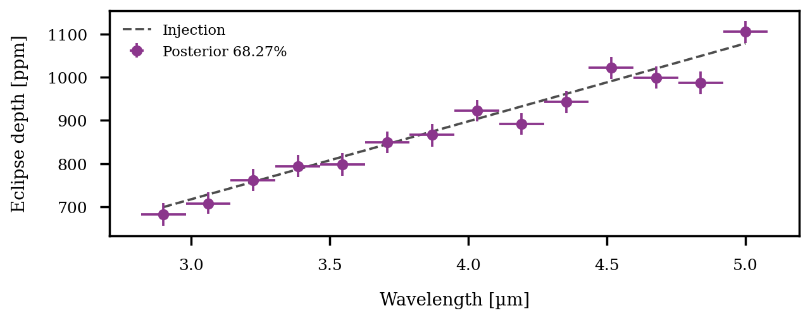
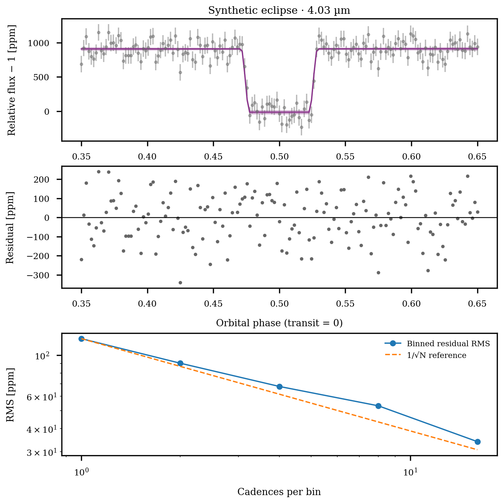
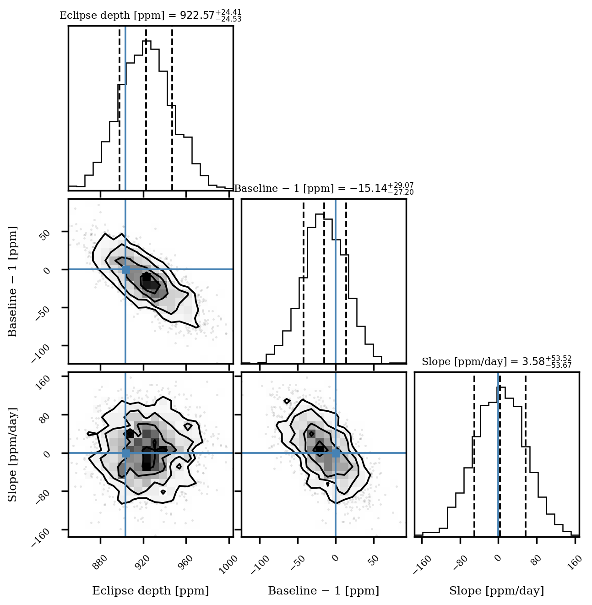
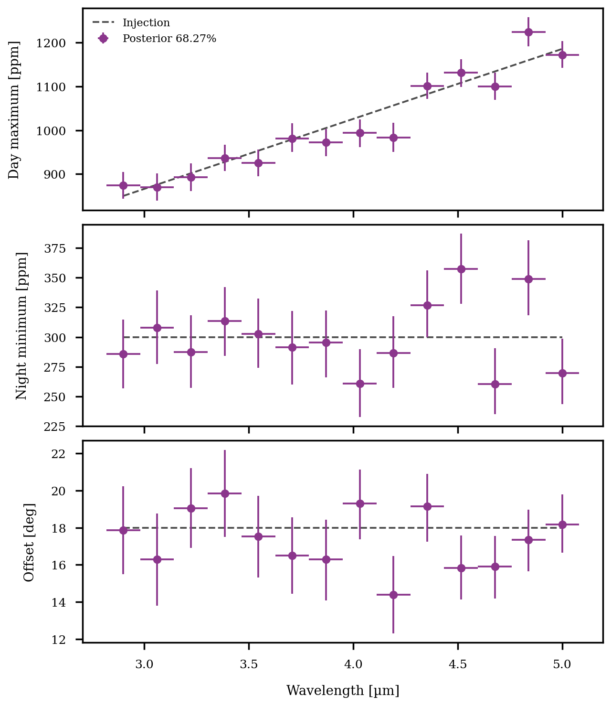
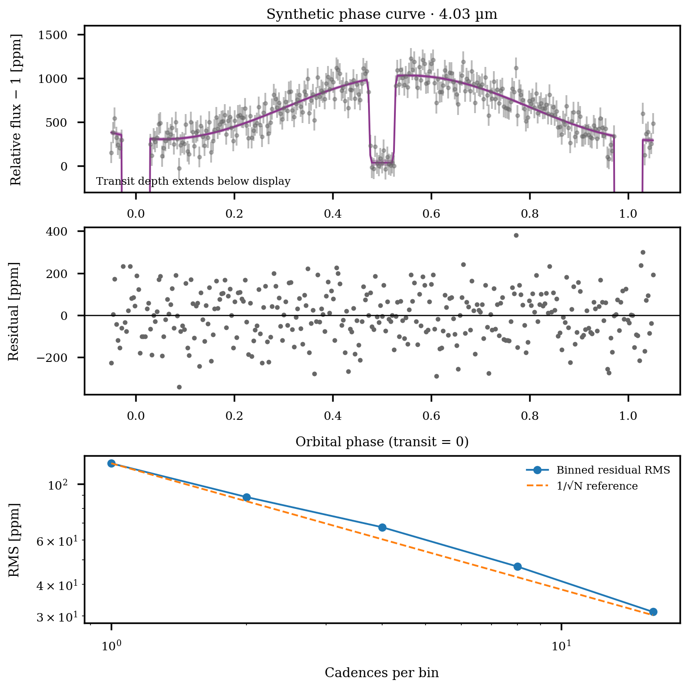
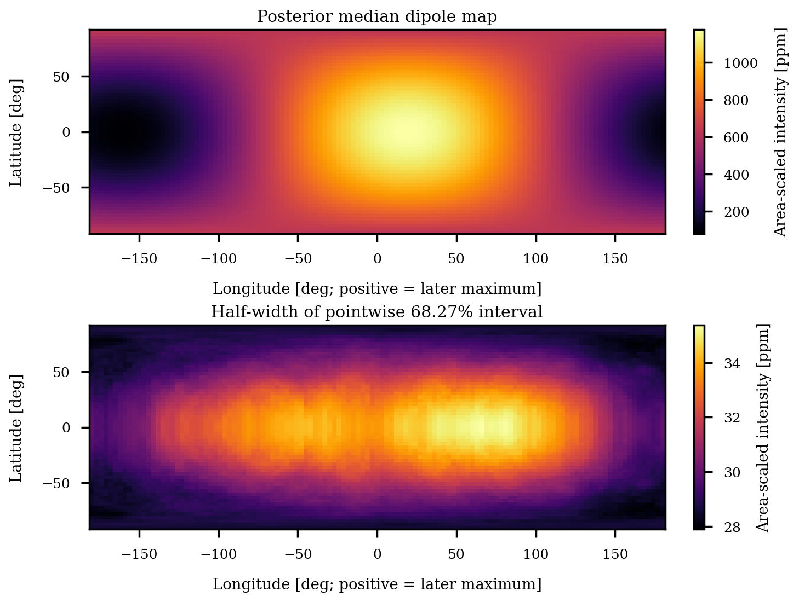
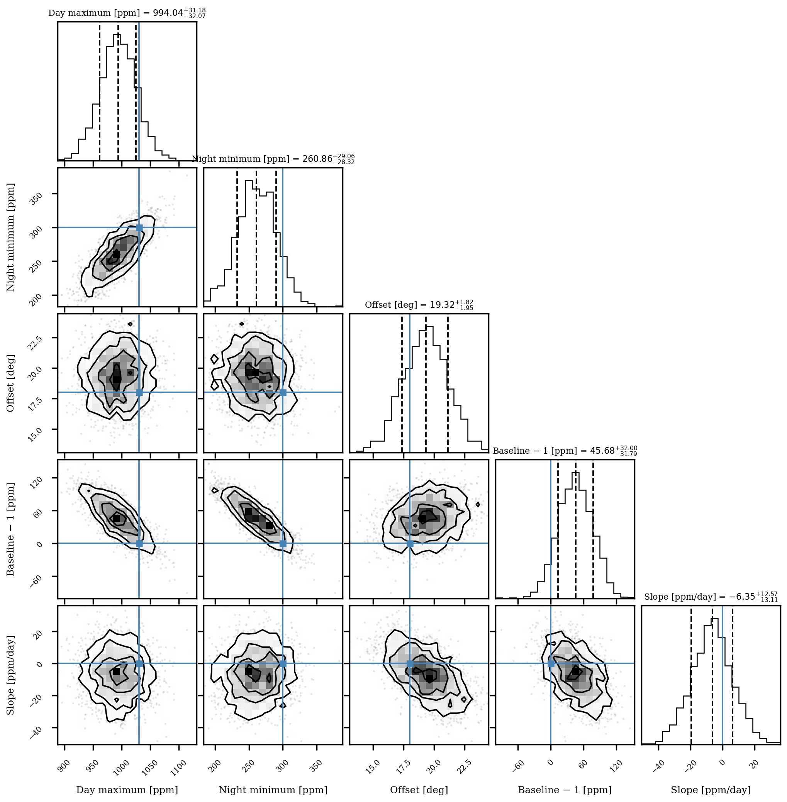
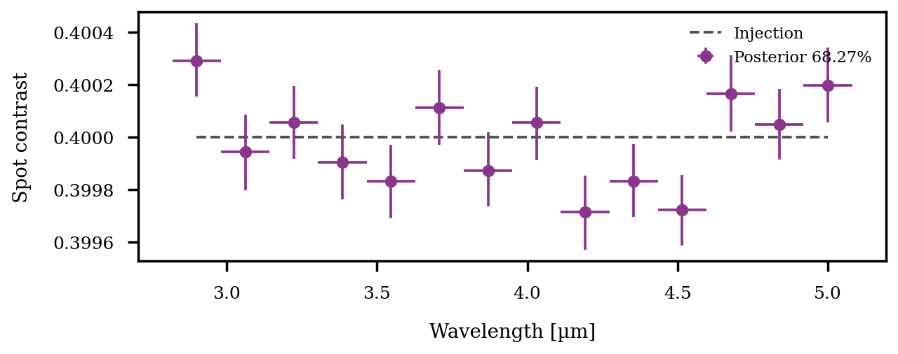
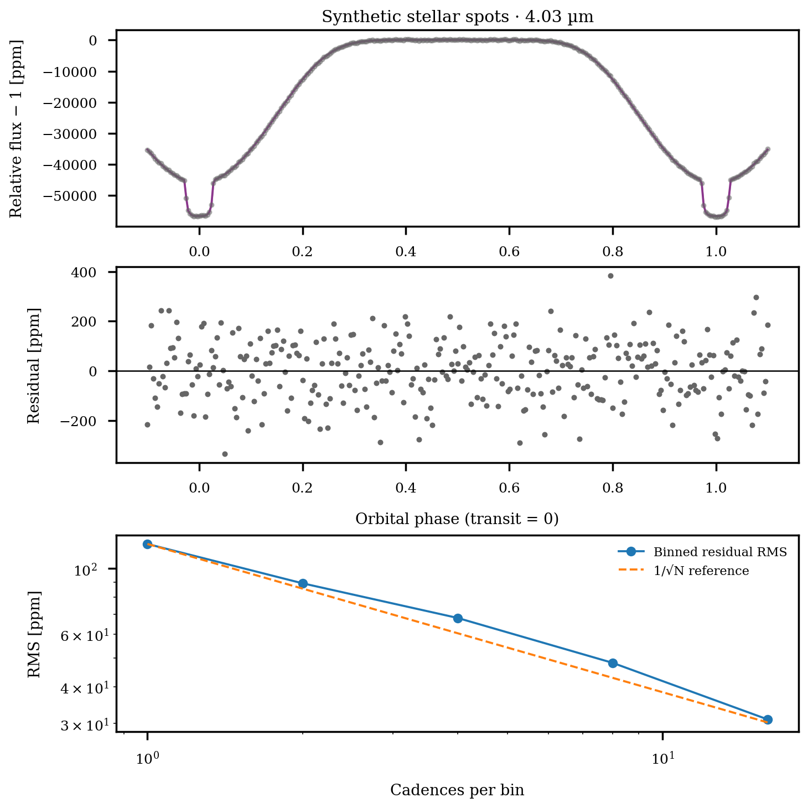
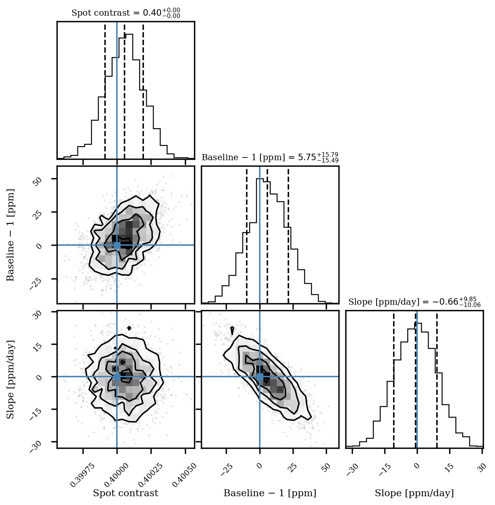

# Synthetic eclipses, phase curves, and stellar spots

This tutorial recovers known signals with Koala's production JAXoplanet/Starry
surface likelihood and emission priors. The figures below are **synthetic
injection–recovery results**, not JWST observations. They demonstrate the
plots and tables you can use to examine an eclipse spectrum, a thermal phase
curve, and a rotating spotted star.

## Run the analysis

Activate the same Python environment used for the fitter, then run from the
repository root:

```bash
python tools/surface_publication_example.py all
```

You need the fitter dependencies, including JAXoplanet's experimental Starry
implementation, NumPyro, Astropy, pandas, Matplotlib, PyYAML, and `corner`.
No observation download or atmosphere grid is required. To run one analysis:

```bash
python tools/surface_publication_example.py eclipse
python tools/surface_publication_example.py phase_curve
python tools/surface_publication_example.py stellar_spots
```

The script uses the geometry, surface priors, and fixed limb darkening from
`examples/eclipse.yaml`, `examples/phase_curve.yaml`, and
`examples/stellar_spots.yaml`. It generates 14 channels from 2.9–5.0 µm using
the existing native surface injection generator, adds independent Gaussian
noise of 120 ppm per cadence per channel, and fits the channels jointly with
two sequential NUTS chains (500 warmup steps and 1,000 retained draws each).
Each channel has its own surface parameters, normalization, and linear slope;
there is no spectral smoothing or shared surface parameter in this fit.
The seed is 20260904; each scenario gets its own repeatable noise realization.

The saved reference run used JAX 0.6.2 and NumPyro 0.19.0 on CPU:

| Analysis | Minimum ESS | Maximum split R-hat | Divergences |
|---|---:|---:|---:|
| Eclipse | 1,850 | 1.00105 | 0 |
| Phase curve | 764 | 1.00228 | 0 |
| Stellar spots | 2,269 | 1.00093 | 0 |

Every injected surface parameter in all 14 channels lay inside its
equal-tailed 99.73% posterior interval in this run. Individual 68.27% intervals
need not contain the truth; this one realization is not a coverage calibration.
The [reference run metadata](../_static/surface_examples/reference_runs.json)
preserves the unrounded convergence results and exact injections.

This is a bounded example analysis: geometry and limb darkening are known,
the noise is supplied, and the extra jitter is fixed to 1 ppm. The sampler
uses the production Laplace metric and physical phase-map prior. It does not
run the full white-light → low-resolution → native-resolution orchestration.
For that workflow, use the existing FITS generator and pipeline:

```bash
python tools/example_phase_curves.py
python fit_jwst.py -c examples/eclipse.yaml
python fit_jwst.py -c examples/phase_curve.yaml
python fit_jwst.py -c examples/stellar_spots.yaml
```

The [surface-model guide](../guides/phase_curves.md) explains those pipeline
configurations and their standard output filenames.

## Eclipse spectrum



The dashed line is the injected planet/star emission spectrum. Points show
posterior medians with equal-tailed 68.27% intervals; horizontal bars show
channel half-widths. The injected depth increases from 700 to 1,078 ppm.
An eclipse depth is a flux ratio, not a transit radius ratio.



The displayed channel is 4.03 µm. The fitted mean light curve includes the
normalization and linear trend; shading is its pointwise 68.27% posterior
credible interval, **without new measurement noise**. The residual panel and
binned RMS provide a check for time structure. The dashed RMS curve scales
the unbinned residual RMS as $N^{-1/2}$; it is a reference, not a statistical
test of the absence of correlated noise.



The corner plot retains covariance with the baseline and slope. Reference
lines mark the injection. It uses actual retained posterior samples from
this channel, not samples reconstructed from the spectrum's error bars.

## Phase-resolved emission and thermal map



This injection has a day-maximum spectrum of 850–1,186 ppm, a 300 ppm night
minimum, and an 18° offset. These day/night parameters are the unocculted
disk-integrated extrema. With a nonzero offset they are not exactly the
fluxes at secondary eclipse and transit. Positive offset places the phase
maximum **later** than secondary eclipse in this implementation.



The phase-curve display zooms to the planetary emission; the primary transit
extends below that display range. All cadences, including transit and eclipse,
are included in the likelihood, residual plot, and saved light-curve archive.



The upper panel is the posterior median brightness map at 4.03 µm. The lower
panel is half the pointwise 68.27% interval width. Both propagate the joint
day/night/offset posterior. Longitude zero faces the observer at secondary
eclipse; positive longitude denotes the direction of a later maximum.
This plotting convention does not assign a geographic east/west sign.

The map is the **assumed degree-one dipole**, with equator-on viewing. It is
not a free two-dimensional eclipse map, and its latitude dependence is imposed
by the model. For longitude $\ell$, latitude $b$, and offset $\delta$, it plots

$$
J(\ell,b) = \frac{F_{\rm day}+F_{\rm night}}{2}
 + \frac{3}{4}(F_{\rm day}-F_{\rm night})\cos b\cos(\ell-\delta).
$$

Here $J=(R_p/R_\star)^2 I_p/\langle I_\star\rangle_{\rm disk}$ in ppm:
local intensity scaled by the planet/star projected area ratio. It is not a
local flux ratio or brightness temperature. Disk integration recovers the
configured extrema. The physical prior restricts the brighter extremum to
at most five times the fainter, ensuring nonnegative local intensity.
A temperature conversion would require a stellar spectrum and bandpass
assumptions that this synthetic tutorial does not supply.



The corner plot exposes correlations among the extrema, hotspot offset, and
instrumental baseline. A narrow map interval describes uncertainty within
this fixed geometry and dipole model; it does not include uncertainty from
unmodeled higher harmonics, stellar variability, or alternative systematics.

## Rotating stellar surface



The spot example uses a radius of 20°, latitude 15°, longitude 0° at transit,
and a two-day stellar rotation period. The injected contrast is 0.4 in every
channel. Positions, radius, rotation, inclination, and limb darkening are
fixed; the fit infers contrast, baseline, and slope. The surface is a smooth
finite-degree Starry representation of a circular spot.





Rotational modulation and occulted spot structure constrain the contrast in
this example. The recovered contrast spectrum is not a spot temperature
spectrum, and fixed spot positions are not measured surface locations.

## Reuse the products

Each scenario writes a directory beneath `results/surface_publication/`:

Download vector figures from the reference run:
[eclipse spectrum](../_static/surface_examples/eclipse_recovery.pdf),
[phase spectra](../_static/surface_examples/phase_curve_recovery.pdf),
[thermal map](../_static/surface_examples/phase_curve_map.pdf), and
[phase corner plot](../_static/surface_examples/phase_curve_corner.pdf).

| File | Contents |
|---|---|
| `recovery.png`, `recovery.pdf` | Spectrum/contrast recovery with injected truth |
| `lightcurve.png`, `lightcurve.pdf` | Representative channel, residuals, and binned RMS |
| `corner.png`, `corner.pdf` | Joint surface and baseline posterior for that channel |
| `map.png`, `map.pdf` | Phase-only dipole map and pointwise uncertainty |
| `spectrum_emission.csv` | Production emission medians and asymmetric 68.27% errors |
| `spectrum_stellar_spots.csv` | Spot medians and asymmetric 68.27% errors, for spots only |
| `posterior.npz` | Parameter arrays with chain, draw, channel, and optional planet/spot axes |
| `sampler.npz` | Per-chain divergence flags |
| `lightcurves.npz` | Observations, errors, truth, and model quantiles at every cadence |
| `thermal_map.npz` | Phase-only longitude/latitude grids and 15.865/50/84.135% intensity quantiles |
| `diagnostics.csv`, `run.json` | ESS, split R-hat, divergences, settings, and versions |
| `synthetic.fits`, `truth.json`, `config.yaml` | Synthetic input, exact injection, and source configuration |

For example, inspect the retained samples without rerunning inference:

```python
import numpy as np
import pandas as pd

root = "results/surface_publication/phase_curve/"
spectrum = pd.read_csv(root + "spectrum_emission.csv")
posterior = np.load(root + "posterior.npz")
# Keep the chain axis for convergence checks; flatten only for plotting.
offset_deg = np.rad2deg(posterior["hotspot_offset"][:, :, 7, 0])
print(spectrum)
print(np.percentile(offset_deg, [15.865, 50, 84.135]))
```

The command returns a failure exit code if any fitted surface or baseline
parameter has ESS below 400, split R-hat at least 1.01, a nonfinite diagnostic,
or if any chain diverges. Products remain available to diagnose failed runs.
`--draws`, `--warmup`, `--seed`, and `--output-dir` let you repeat the analysis;
short smoke runs will generally fail the ESS gate.
To restyle an existing run without sampling again, use
`python tools/surface_publication_example.py all --plot-only` with the same
`--output-dir` as the original run.

For a publication, also assess sensitivity to geometry, limb darkening,
systematics and correlated noise, wavelength binning, and the surface basis.
These independent-noise injections demonstrate recovery under a known model;
they do not establish the adequacy of that model for a real JWST observation.
